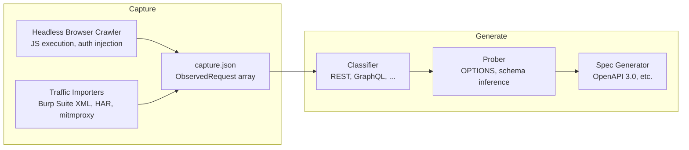

# Vespasian: API Discovery Tool for Security Assessments

[](https://github.com/praetorian-inc/vespasian/actions/workflows/ci.yml)
[](https://goreportcard.com/report/github.com/praetorian-inc/vespasian)
[](LICENSE)

Vespasian discovers API endpoints by observing real HTTP traffic and generates API specification files from those observations. It captures traffic through headless browser crawling or imports it from proxy tools like Burp Suite, HAR archives, and mitmproxy, then classifies the requests, probes discovered endpoints, and outputs specifications in the native format for each API type (OpenAPI 3.0 for REST, with planned support for GraphQL SDL, WSDL, and AsyncAPI for WebSocket).

Built for penetration testers and security engineers who need to map the API attack surface of applications when clients don't provide API documentation.

## Table of Contents

- [Why Vespasian](#why-vespasian)
- [How It Works](#how-it-works)
- [Installation](#installation)
- [Usage](#usage)
- [Use Cases](#use-cases)
- [CLI Reference](#cli-reference)
- [Architecture](#architecture)
- [Development](#development)
- [Contributing](#contributing)
- [License](#license)

## Why Vespasian

Modern applications make API calls dynamically. Single-page applications construct requests at runtime via JavaScript. Mobile apps call APIs through native HTTP clients. Real-time features communicate over WebSocket connections. Static analysis and source code review miss these runtime behaviors entirely.

Existing approaches to API discovery have limitations:

- **Checking known paths** (`/swagger.json`, `/openapi.yaml`) only finds APIs that are explicitly documented
- **Static analysis** cannot observe requests that are constructed dynamically at runtime
- **Manual proxy capture** is time-consuming and produces raw traffic without structured specifications

Vespasian takes a different approach: it observes actual network traffic at the wire level, then uses classification heuristics and light probing to produce structured API specifications automatically. This is inherently probabilistic -Vespasian discovers only the endpoints present in the captured traffic -but it reliably maps the API surface that an application actually exposes during use.

## How It Works

Vespasian uses a two-stage pipeline that separates traffic capture from specification generation:



**Why two stages:**

- **Capture once, generate many** -run different generators against the same capture without re-scanning
- **Debuggable** -the capture file is inspectable JSON, isolating capture bugs from generation bugs
- **Composable** -import traffic from any source (browser crawls, proxy captures, mobile testing)
- **Offline analysis** -generate specifications without network access, useful during limited engagement windows

## Installation

### From source

```bash
go install github.com/praetorian-inc/vespasian/cmd/vespasian@latest
```

### From releases

Download the latest binary from the [Releases](https://github.com/praetorian-inc/vespasian/releases) page.

## Usage

### Quick start: scan a web application

```bash
# Crawl and generate an OpenAPI spec in one step
vespasian scan https://app.example.com -o api.yaml

# With authentication
vespasian scan https://app.example.com -H "Authorization: Bearer <token>" -o api.yaml
```

### Two-stage workflow

```bash
# Stage 1: Capture traffic via headless browser
vespasian crawl https://app.example.com -o capture.json

# Stage 1 (alternative): Import traffic from Burp Suite
vespasian import burp traffic.xml -o capture.json

# Stage 1 (alternative): Import traffic from HAR archive
vespasian import har recording.har -o capture.json

# Stage 1 (alternative): Import traffic from mitmproxy
vespasian import mitmproxy flows -o capture.json

# Stage 2: Generate OpenAPI spec from the capture file
vespasian generate rest capture.json -o api.yaml
```

## Use Cases

### Penetration testing without API documentation

During authorized security assessments, clients often cannot provide API documentation. Vespasian crawls the target application with a headless browser, captures every API call the frontend makes, and produces an OpenAPI specification that describes the discovered endpoints, parameters, and response schemas.

### Generating API specs from existing proxy captures

Pentesters already capture traffic in Burp Suite and mitmproxy during manual testing. Rather than re-crawling, Vespasian can import that traffic and generate specifications from work already done. This is especially useful for mobile application testing, where no browser crawl can observe the API calls.

### Mapping API attack surface for web applications

For attack surface management, Vespasian identifies which API endpoints a web application exposes by executing its JavaScript and intercepting all outbound requests. The resulting specification can feed into further security testing tools that accept OpenAPI input.

## CLI Reference

### `vespasian scan`

Convenience command that crawls a target and generates a specification in one step.

```
vespasian scan <url> [flags]
  -H, --header       Auth headers to inject (repeatable)
  -o, --output       Output spec file (default: stdout)
  --depth            Max crawl depth (default: 3)
  --max-pages        Max pages to visit (default: 100)
  --timeout          Scan timeout (default: 30s)
  --scope            same-origin or same-domain (default: same-origin)
  --headless         Browser mode (default: true)
  --confidence       Min classification confidence (default: 0.5)
  --probe            Enable active probing (default: true)
  -v, --verbose      Show requests in real-time
```

### `vespasian crawl`

Captures HTTP traffic by driving a headless browser through the target application.

```
vespasian crawl <url> [flags]
  -H, --header       Auth headers to inject (repeatable)
  -o, --output       Capture output file (default: stdout)
  --format           Capture format: json, yaml (default: json)
  --depth            Max crawl depth (default: 3)
  --max-pages        Max pages to visit (default: 100)
  --timeout          Scan timeout (default: 30s)
  --scope            same-origin or same-domain (default: same-origin)
  --headless         Browser mode (default: true)
  -v, --verbose      Show requests in real-time
```

### `vespasian import`

Converts traffic from external proxy tools into the Vespasian capture format.

```
vespasian import <format> <file> [flags]
  Formats: burp, har, mitmproxy
  -o, --output       Capture output file (default: stdout)
  --scope            Filter imported traffic by scope
  -v, --verbose      Show imported requests
```

### `vespasian generate`

Produces an API specification from a capture file.

```
vespasian generate <api-type> <capture-file> [flags]
  API types: rest
  -o, --output       Output file (default: stdout)
  --confidence       Min classification confidence (default: 0.5)
  --probe            Enable active probing (default: true)
  -v, --verbose      Show discovered endpoints
```

## Architecture

### Pipeline components

| Component      | Purpose                                                              | Extension point        |
| -------------- | -------------------------------------------------------------------- | ---------------------- |
| **Crawler**    | Drives a headless browser to capture HTTP traffic                    | Protocol-agnostic      |
| **Importers**  | Convert Burp Suite XML, HAR, and mitmproxy traffic to capture format | `TrafficImporter`      |
| **Classifier** | Separates API calls from static assets using heuristics              | `APIClassifier`        |
| **Prober**     | Enriches endpoints via OPTIONS requests and schema inference         | `ProbeStrategy`        |
| **Generator**  | Produces specification files (OpenAPI 3.0 for REST)                  | `SpecGenerator`        |

### REST classification heuristics

Vespasian classifies observed requests as REST API calls based on:

1. **Content-type** -responses with `application/json` or `application/xml`
2. **Static asset exclusion** -drops `.js`, `.css`, `.png`, `.woff`, `/static/`, `/assets/`
3. **Path heuristics** -`/api/`, `/v1/`, `/v2/`, `/rest/` paths boost confidence
4. **HTTP method** -POST/PUT/PATCH/DELETE to non-page URLs
5. **Response structure** -JSON object or array bodies (not HTML)

Requests with confidence above the threshold (default 0.5) pass through to spec generation.

### OpenAPI generation features

- **Path normalization** -`/users/42` and `/users/87` become `/users/{id}`
- **Known literal preservation** -`/me`, `/current`, `/self` stay literal
- **Schema inference** -`{"name":"Alice","age":30}` becomes `{type: object, properties: {name: string, age: integer}}`
- **Parameter extraction** -query parameters are documented with inferred types

### Package layout

```
cmd/vespasian/       CLI entry point
pkg/crawl/           Headless browser crawler + capture format
pkg/importer/        Traffic importers (Burp, HAR, mitmproxy)
pkg/classify/        API classification (REST, with future GraphQL/SOAP/WebSocket)
pkg/probe/           Endpoint probing strategies (OPTIONS, schema inference)
pkg/generate/        Spec generators
pkg/generate/rest/   OpenAPI 3.0 generation, path normalization, schema inference
```

## Development

### Prerequisites

- [Go 1.24+](https://go.dev/dl/)
- [golangci-lint](https://golangci-lint.run/welcome/install/)

### Getting started

```bash
git clone https://github.com/praetorian-inc/vespasian.git
cd vespasian
make build
```

### Common commands

```bash
make build       # Build the binary to bin/vespasian
make test        # Run tests with race detection
make lint        # Run golangci-lint (gocritic, misspell, revive)
make fmt         # Format code with gofmt
make vet         # Run go vet
make check       # Run all checks (fmt, vet, lint, test)
```

## Contributing

1. Fork the repository
2. Create a feature branch (`git checkout -b feature/my-feature`)
3. Commit your changes (`git commit -am 'Add my feature'`)
4. Push to the branch (`git push origin feature/my-feature`)
5. Open a Pull Request

Please ensure all CI checks pass before requesting review.

## License

This project is licensed under the Apache License 2.0 -see the [LICENSE](LICENSE) file for details.

## About Praetorian

[Praetorian](https://www.praetorian.com/) is a cybersecurity company that helps organizations secure their most critical assets through offensive security services and the [Praetorian Guard](https://www.praetorian.com/guard) attack surface management platform.
