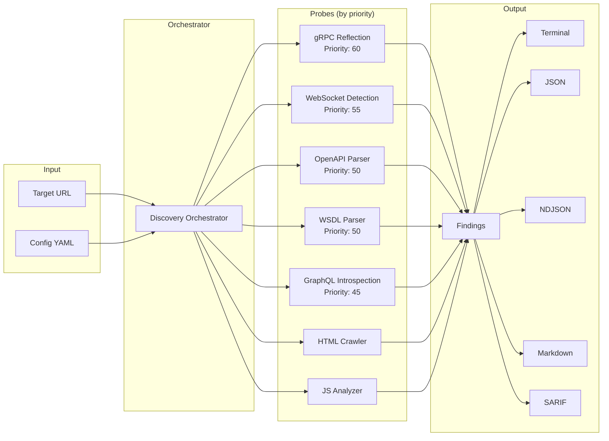

# Vespasian - API Surface Enumeration Tool

[](https://github.com/praetorian-inc/vespasian/actions/workflows/ci.yml)
[](https://codecov.io/gh/praetorian-inc/vespasian)
[](https://go.dev/)
[](LICENSE)
[](https://goreportcard.com/report/github.com/praetorian-inc/vespasian)

> Discover API endpoints across OpenAPI, GraphQL, gRPC, WebSocket, and WSDL with a single tool.

Vespasian is a comprehensive **API surface enumeration tool** that discovers API endpoints from multiple sources including OpenAPI/Swagger specifications, GraphQL introspection, gRPC reflection, WebSocket detection, WSDL/SOAP services, and JavaScript analysis. Built with a plugin architecture for extensibility and designed for security professionals and penetration testers.

## Table of Contents

- [Features](#features)
- [Installation](#installation)
- [Quick Start](#quick-start)
- [Probes](#probes)
- [Output Formats](#output-formats)
- [Configuration](#configuration)
- [Use Cases](#use-cases)
- [API Reference](#api-reference)
- [Contributing](#contributing)
- [License](#license)

## Architecture



The orchestrator runs all applicable probes **concurrently**, sorted by priority. Each probe implements a common interface with `Run()`, `Name()`, `Category()`, `Priority()`, and `Accepts()` methods.

## Features

- **Multi-Protocol Discovery**: Enumerate APIs across HTTP, gRPC, WebSocket, and SOAP protocols
- **OpenAPI/Swagger Parsing**: Automatically detect and parse OpenAPI v2.0, v3.0, and v3.1 specifications
- **GraphQL Introspection**: Discover GraphQL schemas through introspection queries
- **gRPC Reflection**: Enumerate gRPC services using server reflection
- **WebSocket Detection**: Identify WebSocket endpoints and upgrade paths
- **WSDL/SOAP Parsing**: Parse WSDL service definitions for SOAP endpoints
- **JavaScript Analysis**: Extract API endpoints from JavaScript files (fetch, XHR, axios patterns)
- **HTTP Crawling**: Discover API links through intelligent HTML crawling with rate limiting
- **Multiple Output Formats**: Terminal, JSON, NDJSON, Markdown, and SARIF output
- **Plugin Architecture**: Extensible probe system for adding custom discovery methods

## Installation

### From Source

```bash
go install github.com/praetorian-inc/vespasian/cmd/vespasian@latest
```

### Build Locally

```bash
git clone https://github.com/praetorian-inc/vespasian.git
cd vespasian
go build -o vespasian ./cmd/vespasian
```

## Quick Start

### List Available Probes

```bash
vespasian list
```

Output:
```
Available probes:
  - crawler
  - graphql
  - grpc
  - js
  - openapi
  - websocket
  - wsdl
```

### Scan a Target

```bash
# Basic scan with terminal output
vespasian scan config.yaml https://api.example.com

# JSON output for pipeline integration
vespasian scan -f json config.yaml https://api.example.com

# SARIF output for security tools
vespasian scan -f sarif config.yaml https://api.example.com > results.sarif
```

### Configuration File Example

```yaml
# config.yaml
target: "https://api.example.com"
output:
  format: json
probes:
  enabled:
    - openapi
    - graphql
    - crawler
  crawler:
    depth: 3
rate_limit:
  requests_per_second: 10
```

## Probes

Vespasian includes seven discovery probes, each specialized for different API types:

| Probe | Protocol | Description |
|-------|----------|-------------|
| `openapi` | HTTP | Discovers and parses OpenAPI/Swagger specifications (v2.0, v3.0, v3.1) |
| `graphql` | HTTP | Performs GraphQL introspection to enumerate queries and mutations |
| `grpc` | gRPC | Uses server reflection to discover gRPC services and methods |
| `websocket` | WebSocket | Detects WebSocket upgrade endpoints |
| `wsdl` | HTTP/SOAP | Parses WSDL files to extract SOAP service operations |
| `crawler` | HTTP | Crawls HTML pages to discover API links and endpoints |
| `js` | HTTP | Analyzes JavaScript files for fetch/XHR/axios API calls |

### OpenAPI Discovery

Automatically detects OpenAPI specifications at common locations:
- `/openapi.json`, `/openapi.yaml`
- `/swagger.json`, `/swagger.yaml`
- `/api-docs`, `/v1/api-docs`, `/v2/api-docs`

### GraphQL Introspection

Performs introspection queries against GraphQL endpoints:
- `/graphql`
- `/api/graphql`
- `/query`

### JavaScript Analysis

Extracts API endpoints from JavaScript patterns:
- `fetch('/api/...')`
- `axios.get('/api/...')`
- `XMLHttpRequest` calls
- Dynamic URL construction

## Output Formats

| Format | Use Case | Example |
|--------|----------|---------|
| `terminal` | Interactive CLI usage | Colored, human-readable output |
| `json` | API integration | Complete JSON array of findings |
| `ndjson` | Streaming/pipelines | Newline-delimited JSON objects |
| `markdown` | Documentation | Formatted report with tables |
| `sarif` | Security tools | SARIF 2.1.0 for GitHub/IDEs |

### JSON Output Example

```json
[
  {
    "type": "asset",
    "severity": "info",
    "data": {
      "path": "/api/v1/users",
      "method": "GET",
      "probe_category": "http",
      "source": "vespasian"
    }
  }
]
```

## Configuration

### Rate Limiting

Control request rates to avoid overwhelming target servers:

```yaml
rate_limit:
  requests_per_second: 10
  burst: 20
```

### Probe-Specific Settings

```yaml
probes:
  crawler:
    depth: 3          # Maximum crawl depth
    concurrent: 10    # Concurrent requests
    scope: same-host  # Crawl scope (same-host, same-domain)

  openapi:
    locations:        # Custom spec locations
      - /api/openapi.json
      - /docs/swagger.yaml
    versions:
      - "3.0"
      - "3.1"

  graphql:
    introspection: true
    common_paths:
      - /graphql
      - /api/graphql
```

## Use Cases

### Security Assessment

Enumerate the complete API attack surface before penetration testing:

```bash
vespasian scan -f sarif config.yaml https://target.com > attack-surface.sarif
```

### API Documentation Audit

Verify that all API endpoints are documented:

```bash
vespasian scan -f json config.yaml https://api.internal.com | jq '.[] | .data.path'
```

### CI/CD Integration

Integrate API surface monitoring into your pipeline:

```yaml
# .github/workflows/api-surface.yml
- name: Enumerate API Surface
  run: |
    vespasian scan -f json config.yaml ${{ env.API_URL }} > api-surface.json
    # Compare with baseline...
```

### Reconnaissance

Discover undocumented API endpoints during security research:

```bash
vespasian scan config.yaml https://target.com 2>/dev/null | grep -E "api|v[0-9]"
```

## API Reference

### CLI Commands

```
vespasian [command]

Commands:
  scan     Scan targets for API surfaces
  list     List available probes
  version  Show version information

Flags:
  -f, --format   Output format (terminal, json, ndjson, markdown, sarif)
  -h, --help     Help for vespasian
```

### Probe Interface

Custom probes implement the `Probe` interface:

```go
type Probe interface {
    Run(ctx context.Context, target Target, opts ProbeOptions) (*ProbeResult, error)
    Name() string
    Category() ProbeCategory
    Priority() int
    Accepts(target Target) bool
}
```

## Frequently Asked Questions

### How do I scan a target that requires authentication?

Add custom headers to your configuration file:

```yaml
http:
  headers:
    Authorization: "Bearer your-token-here"
    X-API-Key: "your-api-key"
```

### Why isn't GraphQL introspection returning results?

Many production GraphQL servers disable introspection for security. Check if:
1. The server allows introspection (common in development environments)
2. You have the correct endpoint path (try `/graphql`, `/api/graphql`, `/query`)
3. Authentication is required for introspection queries

### How do I add custom OpenAPI specification locations?

Configure custom paths in your YAML config:

```yaml
probes:
  openapi:
    locations:
      - /api/openapi.json
      - /docs/swagger.yaml
      - /internal/api-docs
```

### What's the difference between JSON and NDJSON output?

- **JSON**: Complete array of all findings, ideal for post-processing with `jq`
- **NDJSON**: Newline-delimited JSON, streams results as discovered—better for large scans and pipeline integration

### Can I run only specific probes?

Yes, enable only the probes you need:

```yaml
probes:
  enabled:
    - openapi
    - graphql
  # Other probes will be skipped
```

## Troubleshooting

### Error: "connection refused"

**Cause**: Target server is not reachable or not running.

**Solutions**:
1. Verify the target URL is correct and accessible
2. Check network connectivity and firewall rules
3. Ensure the target service is running

### Error: "rate limit exceeded" or 429 responses

**Cause**: Sending requests too quickly for the target server.

**Solution**: Reduce request rate in your configuration:

```yaml
rate_limit:
  requests_per_second: 5  # Lower this value
  burst: 10
```

### Error: "TLS handshake failure"

**Cause**: SSL/TLS certificate issues with the target.

**Solutions**:
1. Verify the target uses valid certificates
2. For testing with self-signed certs, consider using a proxy

### No endpoints discovered

**Possible causes**:
1. Target doesn't expose API specifications at common locations
2. Introspection/reflection is disabled on the target
3. Authentication required but not configured

**Debugging steps**:
1. Run with verbose output to see probe attempts
2. Manually verify specification URLs exist
3. Check if authentication headers are needed

## Contributing

We welcome contributions! Please see our [Contributing Guide](CONTRIBUTING.md) for details.

### Development Setup

```bash
git clone https://github.com/praetorian-inc/vespasian.git
cd vespasian
go mod download
go test ./...
```

### Adding a New Probe

1. Create a new package under `pkg/`
2. Implement the `Probe` interface
3. Register via `init()` function
4. Add tests

## Support

If you find Vespasian useful, please consider giving it a ⭐ on GitHub!

[](https://github.com/praetorian-inc/vespasian)

## License

Apache License 2.0 - see [LICENSE](LICENSE) for details.

---

Built by [Praetorian](https://www.praetorian.com/) for security professionals.
