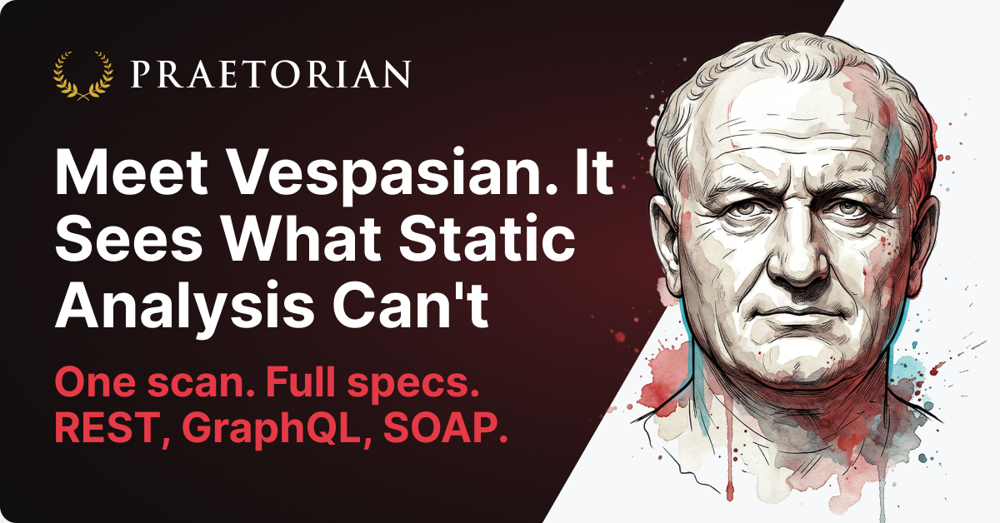
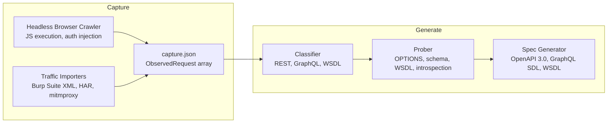

<p align="center">
  <a href="https://github.com/praetorian-inc/vespasian">
    
  </a>
</p>

<p align="center">
  <strong>Discover API endpoints from real HTTP traffic. Generate OpenAPI, GraphQL SDL, and WSDL specs automatically.</strong>
</p>

<p align="center">
  <a href="https://github.com/praetorian-inc/vespasian/actions/workflows/ci.yml"></a>
  <a href="https://goreportcard.com/report/github.com/praetorian-inc/vespasian"></a>
  <a href="LICENSE"></a>
</p>

---

# Vespasian: API Discovery and Specification Generation Tool

**Vespasian discovers API endpoints by observing real HTTP traffic and generates API specification files from those observations.** It captures traffic through headless browser crawling or imports it from existing sources (Burp Suite XML exports, HAR files, and mitmproxy dumps), then classifies requests, probes discovered endpoints, and outputs specifications in the native format for each API type: OpenAPI 3.0 for REST, GraphQL SDL for GraphQL, and WSDL for SOAP services.

Built for penetration testers and security engineers who need to map the API attack surface of web applications, single-page apps, and microservices when the API documentation is not available.

## Why Vespasian?

Modern applications make API calls dynamically. Single-page applications construct requests at runtime via JavaScript. Mobile apps call APIs through native HTTP clients. Real-time features communicate over WebSocket connections. Static analysis and source code review miss these runtime behaviors entirely.

Existing approaches to API discovery have limitations:

- **Checking known paths** (`/swagger.json`, `/openapi.yaml`) only finds APIs that are explicitly documented
- **Static analysis** cannot observe requests that are constructed dynamically at runtime
- **Manual proxy capture** is time-consuming and produces raw traffic without structured specifications

Vespasian takes a different approach: it observes actual network traffic at the wire level, then uses classification heuristics and active probing to produce structured API specifications automatically. Because this is inherently probabilistic, Vespasian discovers only the endpoints present in the captured traffic, but it reliably maps the API surface that an application actually exposes during use.

## Key Features

| Feature | Description |
|---------|-------------|
| **REST API Discovery** | Classifies REST endpoints via content-type, path patterns, and response structure; outputs OpenAPI 3.0 |
| **GraphQL API Discovery** | Detects GraphQL endpoints, runs tiered introspection queries, and generates GraphQL SDL schemas |
| **WSDL/SOAP Discovery** | Identifies SOAP services via SOAPAction headers and envelope detection; fetches and parses WSDL documents |
| **API Type Auto-Detection** | Automatically determines API type (REST, GraphQL, WSDL) from captured traffic without manual selection |
| **Headless Browser Crawling** | Drives a headless Chrome browser with full JavaScript execution for SPA support, powered by [Katana](https://github.com/projectdiscovery/katana) |
| **Traffic Import** | Import existing captures from Burp Suite XML, HAR 1.2 files, and mitmproxy dumps |
| **Active Probing** | OPTIONS discovery, JSON schema inference, WSDL document fetching, and GraphQL introspection |
| **Path Normalization** | `/users/42` and `/users/87` become `/users/{id}` with known literal preservation (`/me`, `/self`) |
| **SSRF Protection** | Blocks crawling and probing of private and loopback addresses by default. Pass `--dangerous-allow-private` to test internal targets (localhost, 127.0.0.1, RFC1918, link-local); the flag is required when the seed URL is itself a private host. |
| **Proxy Support** | Route headless browser traffic through Burp Suite or other intercepting proxies |
| **Two-Stage Pipeline** | Capture once, generate many: separate capture and generation steps for maximum flexibility |

## How It Works

Vespasian uses a two-stage pipeline that separates traffic capture from specification generation:



**Why two stages:**

- **Capture once, generate many.** Run different generators against the same capture without re-scanning.
- **Debuggable.** The capture file is inspectable JSON, isolating capture bugs from generation bugs.
- **Composable.** Import traffic from any source (browser crawls, proxy captures, mobile testing).
- **Offline analysis.** Generate specifications without network access, useful during limited engagement windows.

## How to Install Vespasian

### Install from Source (Go)

```bash
go install github.com/praetorian-inc/vespasian/cmd/vespasian@latest
```

### Download Pre-Built Binary

Download the latest binary for your platform from the [Releases](https://github.com/praetorian-inc/vespasian/releases) page.

### Build from Source

```bash
git clone https://github.com/praetorian-inc/vespasian.git
cd vespasian
make build
```

## How to Discover APIs with Vespasian

### Quick Start: Scan a Web Application

```bash
# Crawl and generate an API spec in one step (auto-detects API type)
vespasian scan https://app.example.com -o api.yaml

# With authentication
vespasian scan https://app.example.com -H "Authorization: Bearer <token>" -o api.yaml

# Specify the API type explicitly
vespasian scan https://app.example.com --api-type graphql -o schema.graphql
```

### Two-Stage Workflow

```bash
# Stage 1: Capture traffic via headless browser
vespasian crawl https://app.example.com -o capture.json

# Stage 1 (alternative): Import traffic from Burp Suite
vespasian import burp traffic.xml -o capture.json

# Stage 1 (alternative): Import traffic from HAR archive
vespasian import har recording.har -o capture.json

# Stage 1 (alternative): Import traffic from mitmproxy
vespasian import mitmproxy flows -o capture.json

# Stage 2: Generate OpenAPI spec for REST
vespasian generate rest capture.json -o api.yaml

# Stage 2: Generate GraphQL SDL schema
vespasian generate graphql capture.json -o schema.graphql

# Stage 2: Generate WSDL from SOAP traffic
vespasian generate wsdl capture.json -o service.wsdl
```

### Common Options

```bash
# Route crawl traffic through Burp Suite
vespasian scan https://app.example.com --proxy http://127.0.0.1:8080 -o api.yaml

# Scan a local/private target (bypasses SSRF protection)
vespasian scan http://localhost:3000 --dangerous-allow-private -o api.yaml

# Verbose output to see discovered requests in real-time
vespasian scan https://app.example.com -v -o api.yaml

# Suppress the startup banner
vespasian --no-banner scan https://app.example.com -o api.yaml
```

## Use Cases

### Penetration Testing without API Documentation

During authorized security assessments, clients often cannot provide API documentation. Vespasian crawls the target application with a headless browser, captures every API call the frontend makes, and produces specifications that describe the discovered endpoints, parameters, and response schemas.

### Generating API Specs from Existing Proxy Captures

Pentesters already capture traffic in Burp Suite and mitmproxy during manual testing. Rather than re-crawling, Vespasian can import that traffic and generate specifications from work already done. This is especially useful for mobile application testing, where no browser crawl can observe the API calls.

### Mapping API Attack Surface for Web Applications

For attack surface management, Vespasian identifies which API endpoints a web application exposes by executing its JavaScript and intercepting all outbound requests. The resulting specification can feed into further security testing tools that accept OpenAPI, GraphQL SDL, or WSDL input.

### Feeding into Hadrian for Authorization Testing

Generate an API specification with Vespasian, then pass it directly to [Hadrian](https://github.com/praetorian-inc/hadrian) for automated OWASP API Top 10 authorization testing. This creates a complete discover-then-test workflow.

## API Type Support

Vespasian classifies and generates specifications for three API types:

| API Type | Classification Signals | Output Format | Probing |
|----------|----------------------|---------------|---------|
| **REST** | JSON/XML content-type, `/api/` `/v1/` path patterns, HTTP methods | OpenAPI 3.0 (YAML/JSON) | OPTIONS discovery, JSON schema inference |
| **GraphQL** | `/graphql` path, query structure in POST body, `data`/`errors` response keys | GraphQL SDL | Tiered introspection queries (3 tiers for WAF bypass) |
| **WSDL/SOAP** | SOAPAction header, SOAP envelope in body, `?wsdl` URL parameter | WSDL XML | Active `?wsdl` document fetching |

### REST Classification Heuristics

1. **Content-type**: responses with `application/json` or `application/xml`
2. **Static asset exclusion**: drops `.js`, `.css`, `.png`, `.woff`, `/static/`, `/assets/`
3. **Path heuristics**: `/api/`, `/v1/`, `/v2/`, `/v3/`, `/rest/`, `/rpc/` paths boost confidence
4. **HTTP method**: POST/PUT/PATCH/DELETE to non-page URLs
5. **Response structure**: JSON object or array bodies (not HTML)

### GraphQL Classification Heuristics

1. **Path matching**: `/graphql` path (0.70 confidence)
2. **Query structure**: GraphQL query syntax in POST body (0.85 confidence)
3. **Response structure**: `data`/`errors` keys in response (0.80 confidence)
4. **Combined signals**: path + body together (0.95 confidence)

### GraphQL Introspection

Vespasian uses a tiered introspection strategy to handle WAF-protected GraphQL servers:

- **Tier 1**: Full introspection with descriptions, deprecation, and directives
- **Tier 2**: Minimal-complete query without descriptions, deprecation info, or directives
- **Tier 3**: Minimal last-resort query with the smallest payload
- **Fallback**: Traffic-based inference from observed queries and mutations when introspection is disabled

## CLI Reference

### `vespasian scan`

Convenience command that crawls a target and generates a specification in one step.

```
vespasian scan <url> [flags]
  --api-type         API type: auto, rest, graphql, wsdl (default: auto)
  -H, --header       Auth headers to inject (repeatable)
  -o, --output       Output spec file (default: stdout)
  --depth            Max crawl depth (default: 3)
  --max-pages        Max pages to visit (default: 100)
  --timeout          Maximum duration for the entire scan (default: 10m)
  --scope            same-origin or same-domain (default: same-origin)
  --headless         Browser mode (default: true)
  --proxy            Proxy URL for headless browser (e.g., http://127.0.0.1:8080)
  --confidence       Min classification confidence (default: 0.5)
  --probe            Enable active probing (default: true)
  --deduplicate      Deduplicate endpoints before probing (default: true)
  --dangerous-allow-private  Disable SSRF protection for crawling and probes,
                     allowing private/localhost targets. Required when the seed
                     URL is a private host (localhost, 127.0.0.1, RFC1918,
                     link-local).
  --no-request-id    Disable auto X-Vespasian-Request-Id header
  -v, --verbose      Show requests in real-time
```

### `vespasian crawl`

Captures HTTP traffic by driving a headless browser through the target application.

```
vespasian crawl <url> [flags]
  -H, --header       Auth headers to inject (repeatable)
  -o, --output       Capture output file (default: stdout)
  --depth            Max crawl depth (default: 3)
  --max-pages        Max pages to visit (default: 100)
  --timeout          Maximum duration for the entire crawl (default: 10m)
  --scope            same-origin or same-domain (default: same-origin)
  --headless         Browser mode (default: true)
  --proxy            Proxy URL for headless browser (e.g., http://127.0.0.1:8080)
  --dangerous-allow-private  Disable SSRF protection for private/localhost targets.
                     Required when the seed URL is a private host (localhost,
                     127.0.0.1, RFC1918, link-local).
  --no-request-id    Disable auto X-Vespasian-Request-Id header
  -v, --verbose      Show requests in real-time
```

### `vespasian import`

Converts traffic captures from external tools and formats into the Vespasian capture format.

```
vespasian import <format> <file> [flags]
  Formats: burp, har, mitmproxy
  -o, --output       Capture output file (default: stdout)
  -v, --verbose      Show imported requests
```

### `vespasian generate`

Produces an API specification from a capture file.

```
vespasian generate <api-type> <capture-file> [flags]
  API types: rest, graphql, wsdl
  -o, --output       Output file (default: stdout)
  --confidence       Min classification confidence (default: 0.5)
  --probe            Enable active probing (default: true)
  --deduplicate      Deduplicate endpoints before probing (default: true)
  --dangerous-allow-private  Disable SSRF protection on the probe path
                     (OPTIONS/schema/WSDL-fetch/GraphQL introspection requests
                     to private hosts).
  -v, --verbose      Show discovered endpoints
```

## Architecture

### Pipeline Components

| Component | Purpose | Supported Types |
|-----------|---------|-----------------|
| **Crawler** | Drives a headless browser to capture HTTP traffic, powered by [Katana](https://github.com/projectdiscovery/katana) | Protocol-agnostic |
| **Importers** | Convert Burp Suite XML, HAR, and mitmproxy traffic to capture format | All three formats |
| **Classifier** | Separates API calls from static assets using heuristics | REST, GraphQL, WSDL |
| **Prober** | Enriches endpoints via active requests | OPTIONS, JSON schema, WSDL fetch, GraphQL introspection |
| **Generator** | Produces specification files from classified and probed traffic | OpenAPI 3.0, GraphQL SDL, WSDL |

### Package Layout

```
cmd/vespasian/          CLI entry point
pkg/crawl/              Headless browser crawler + capture format
pkg/importer/           Traffic importers (Burp, HAR, mitmproxy)
pkg/classify/           API classification (REST, GraphQL, WSDL)
pkg/probe/              Endpoint probing (OPTIONS, schema, WSDL, GraphQL introspection)
pkg/generate/
  ├── rest/             OpenAPI 3.0 generation, path normalization, schema inference
  ├── graphql/          GraphQL SDL generation, introspection, traffic inference
  └── wsdl/             WSDL generation, SOAP operation extraction
```

## Frequently Asked Questions

### What types of APIs can Vespasian discover?

Vespasian discovers **REST APIs** (generating OpenAPI 3.0 specs), **GraphQL APIs** (generating SDL schemas via introspection or traffic inference), and **SOAP/WSDL services** (generating WSDL documents). It automatically detects the API type from captured traffic, or you can specify it explicitly with `--api-type`.

### How is Vespasian different from running a web crawler?

Standard web crawlers follow HTML links and index pages. Vespasian intercepts **all HTTP traffic** from a headless browser, including XHR/fetch API calls, WebSocket upgrades, and dynamically constructed requests that don't appear in HTML. It then classifies those requests by API type and generates structured specifications, not just URL lists.

### Does Vespasian find undocumented APIs?

Vespasian discovers any API endpoint that the application calls during the crawl. If the frontend calls `/api/internal/debug` at runtime, Vespasian will capture and document it, even if it doesn't appear in any published API documentation.

### Can I use Vespasian with traffic I've already captured?

Yes. If you've already captured traffic using Burp Suite, browser dev tools (HAR), or mitmproxy, use `vespasian import` to convert it to the capture format, then `vespasian generate` to produce specifications. No re-crawling needed.

### Does Vespasian handle GraphQL servers that disable introspection?

Yes. Vespasian uses a tiered introspection strategy. If the full introspection query is blocked, it tries progressively simpler queries. If all introspection is disabled, it falls back to inferring the schema from observed queries and mutations in the captured traffic.

### Is it safe to run against production?

Vespasian's crawl stage drives a browser and follows links, which is read-only. The probing stage sends OPTIONS requests, fetches `?wsdl` documents, and runs GraphQL introspection queries, all of which are read-only operations. However, always coordinate with the target owner and prefer staging environments during security assessments.

## Development

### Prerequisites

- [Go 1.24+](https://go.dev/dl/)
- [golangci-lint](https://golangci-lint.run/welcome/install/)

### Build and Test

```bash
git clone https://github.com/praetorian-inc/vespasian.git
cd vespasian
make build       # Build the binary to bin/vespasian
make test        # Run tests with race detection
make lint        # Run golangci-lint (gocritic, misspell, revive)
make check       # Run all checks (fmt, vet, lint, test)
```

```bash
make coverage    # Generate coverage report
make deps        # Download and tidy modules
make clean       # Remove build artifacts
```

## Contributing

1. Fork the repository
2. Create a feature branch (`git checkout -b feature/my-feature`)
3. Commit your changes (`git commit -am 'Add my feature'`)
4. Push to the branch (`git push origin feature/my-feature`)
5. Open a Pull Request

Please ensure all CI checks pass before requesting review.

## License

This project is licensed under the Apache License 2.0. See the [LICENSE](LICENSE) file for details.

## About Praetorian

[Praetorian](https://www.praetorian.com/) is a cybersecurity company that helps organizations secure their most critical assets through offensive security services and the [Praetorian Guard](https://www.praetorian.com/guard) attack surface management platform.
